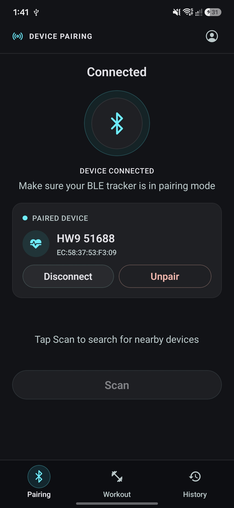
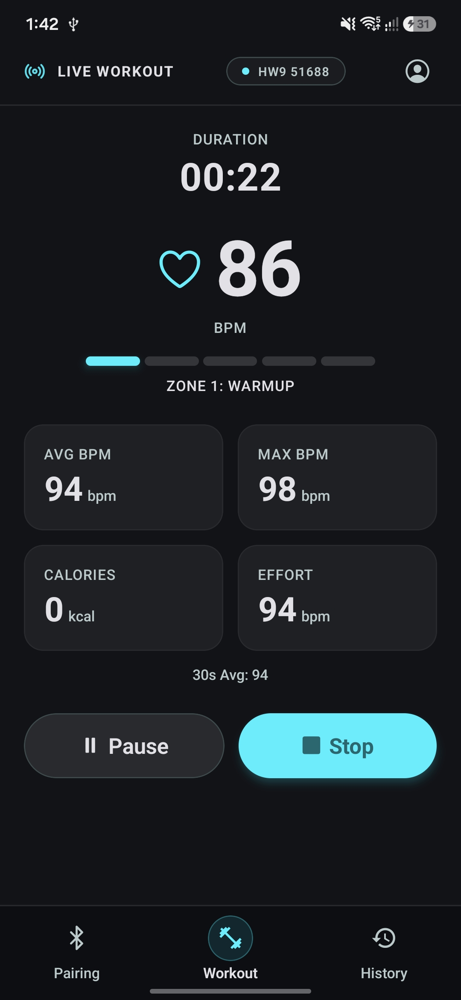
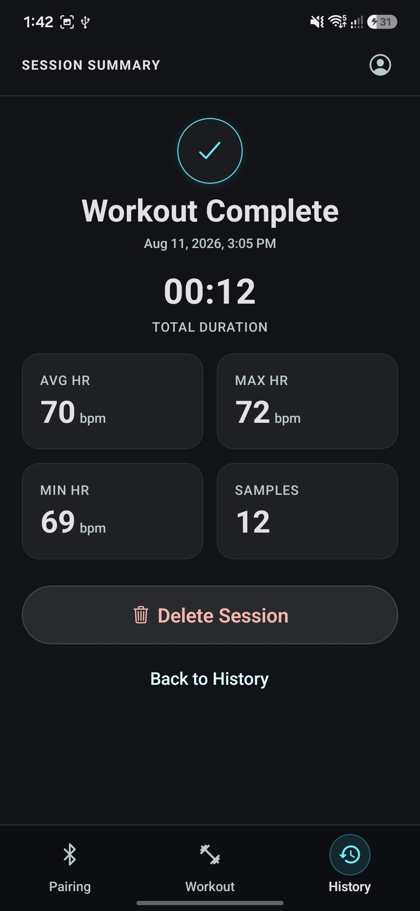
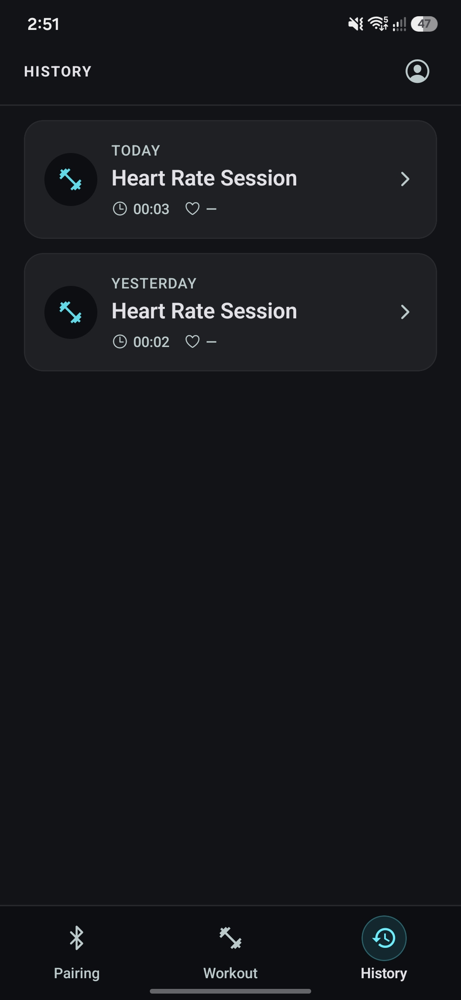

# Fitness Tracker

A React Native / Expo app that pairs with a standard BLE Heart Rate device (GATT service
`0x180D`), records live workout sessions, and writes them back to Health Connect.

Android only - see [`CLAUDE.md`](./CLAUDE.md) for the full set of project decisions and
non-negotiables (no iOS, no custom backend, Expo SDK 56, dev client required).

_Note: This project is updated regularly, and this README is kept up-to-date alongside
it. Anything described below as "not yet implemented" is scoped for a later milestone._

## Screenshots

|                                                  Device Pairing                                                   |                                                  Active Workout                                                   |                                                   Session Summary                                                    |                                               History                                               |
| :---------------------------------------------------------------------------------------------------------------: | :---------------------------------------------------------------------------------------------------------------: | :------------------------------------------------------------------------------------------------------------------: | :-------------------------------------------------------------------------------------------------: |
| &nbsp;&nbsp;&nbsp;&nbsp; | &nbsp;&nbsp;&nbsp;&nbsp; | &nbsp;&nbsp;&nbsp;&nbsp; | &nbsp;&nbsp;&nbsp;&nbsp; |

## Features

Scope is tracked in [`docs/specs.md`](./docs/specs.md), milestone by milestone.

### Milestone 1 - Core BLE + local tracking ✅ Done

- **BLE permission handling**: Android 12+ runtime permission flow
  (`BLUETOOTH_SCAN` / `BLUETOOTH_CONNECT` / `ACCESS_FINE_LOCATION`) gates entry to the
  app, with retry and "open settings" recovery paths.
- **Device pairing screen**: scans for nearby devices advertising the Heart Rate Service
  (`0x180D`), lists them by signal strength, and connects by tapping one.
- **Explicit connection state machine** (`idle | scanning | connecting | connected |
disconnected | error`) that stays stable across drops and failed scans.
- **Auto-reconnect**: the last-paired device ID is persisted locally and reconnected to
  automatically on next launch.
- **Live workout screen**: live BPM readout from Heart Rate Measurement notifications,
  an elapsed session timer with Start / Pause / Resume / Stop, and a rolling average
  BPM. Disconnects mid-session show a reconnecting indicator rather than ending the
  session.
- **Session summary screen**: total duration and avg/max/min HR shown immediately after
  Stop; the session is saved to local storage before anything else happens.
- **History screen**: past sessions listed newest-first (date, duration, avg HR), tap
  through to reopen a session's summary.
- **Local persistence**: namespaced MMKV key-value storage for the last-paired device
  and session history. HR is optional per session - every stat works with zero HR
  samples.

### Milestone 2 - Platform integration, sync, polish (in progress)

- **i18n**: English and Japanese translations, with a language switcher on the Settings
  screen and locale coverage tests. ✅ Implemented.
- **Accessibility**: roles, labels, hints, and selected-state across screens and
  components. ✅ Implemented.
- **Crash reporting**: Firebase Crashlytics wired in behind a thin service. ✅
  Implemented.
- Units toggle (metric/imperial). _Not yet implemented._
- Health Connect write-back for completed sessions (Android's platform health store;
  Google Fit is deliberately not used, it's deprecated). _Not yet implemented._
- Offline/online indicator for anything needing a network call. _Not yet implemented._
- Google login (Firebase Auth) + Firestore cloud sync for units/language settings. _Not
  yet implemented - `@react-native-firebase/app` is installed and configured, `auth` and
  `firestore` are not yet added._
- Graceful web/tablet degradation where live BLE pairing isn't available. _Not yet
  implemented._

### Milestone 3 / stretch - not started

- Strava API integration (import + export activities).
- GPS route tracking with a map polyline redraw.
- Step counting via Health Connect.
- MET + HR-adjusted calorie estimation.
- Weight tracking with history/chart.
- GPS-derived altitude profile.

## Tech Stack

Per [`docs/specs.md`](./docs/specs.md) and [`package.json`](./package.json). Some
packages below are specified but not yet installed - noted inline.

- **Framework**: [React Native](https://reactnative.dev) 0.85 & [Expo](https://expo.dev/)
  SDK 56, React 19, New Architecture on.
- **Routing**: [Expo Router](https://docs.expo.dev/router/introduction/) (file-based
  routing).
- **BLE**: [`react-native-ble-plx`](https://github.com/Polidea/react-native-ble-plx) for
  scanning, connecting, and subscribing to Heart Rate Measurement notifications.
- **State Management**: [Zustand](https://zustand-demo.pmnd.rs/) for the session state
  machine and settings.
- **Storage**: [MMKV](https://github.com/mrousavy/react-native-mmkv)
  (`react-native-mmkv`) for namespaced key-value data (last-paired device, units,
  language, session history).
- **Keep Awake**: `expo-keep-awake`, so the live workout screen doesn't sleep
  mid-session.
- **Animation & Gestures**: [React Native Reanimated](https://docs.swmansion.com/react-native-reanimated/),
  [Gesture Handler](https://docs.swmansion.com/react-native-gesture-handler/),
  React Native Screens, React Native Safe Area Context - Expo Router dependencies, also
  used for the animated BPM readout.
- **i18n**: [`i18n-js`](https://github.com/fnando/i18n-js) + `expo-localization` for
  English/Japanese translations and device-locale detection.
- **Crash Reporting**: `@react-native-firebase/app` + `@react-native-firebase/crashlytics`
  (optional, already wired in).
- **Testing**: [`jest-expo`](https://docs.expo.dev/develop/unit-testing/) with
  [`@testing-library/react-native`](https://callstack.github.io/react-native-testing-library/)
  for unit and component tests. Maestro for E2E flows it can drive (manual-entry and
  history), planned for Milestone 2. _Maestro not yet installed._
- **Linting & Code Quality**: [Oxlint](https://oxc.rs/docs/guide/usage/linter.html),
  Prettier, Husky, lint-staged.

Deferred, rest of Milestone 2:

- [`react-native-health-connect`](https://github.com/matinzd/react-native-health-connect)
  for Health Connect read/write.
- `expo-build-properties` for the Health Connect `minSdkVersion` / `compileSdkVersion`.
- `@react-native-firebase/auth` + `@react-native-firebase/firestore` for Google login and
  cloud settings sync (`@react-native-firebase/app` is already installed and configured).
- `@react-native-google-signin/google-signin` for Google Sign-In.
- `@react-native-community/netinfo` for connectivity status.
- `react-native-svg` for the HR chart.

Deferred to Milestone 3 / stretch:

- `expo-secure-store` + `expo-auth-session` for Strava OAuth.
- `expo-location` + `expo-task-manager` for route sampling.
- `react-native-maps` or `@rnmapbox/maps` for route polylines.
- `expo-sqlite` for per-second time-series data (HR, GPS, altitude) once that volume
  outgrows MMKV's JSON blobs.
- TanStack Query, only if Strava's REST API is integrated.

## Getting Started

### Prerequisites

- [Node.js](https://nodejs.org/) and [pnpm](https://pnpm.io/).
- Android Studio (emulator) or a physical Android device with USB debugging enabled.
- **This app does not run in Expo Go.** The native BLE module requires a custom dev
  client, built via `expo run:android`.

### Installation

1. Clone the repository and navigate into the project directory.
2. Install dependencies:
   ```bash
   pnpm install
   ```

### Running the App

Build and install the dev client, then start Metro against it:

```bash
pnpm android   # expo run:android - builds and installs the dev client
pnpm start     # starts Metro for the dev client
```

`pnpm ios` and `pnpm web` exist in `package.json` as leftover template scripts - neither
is a supported target for this project.

## Available Scripts

- **`pnpm start`**: Starts Metro for the dev client.
- **`pnpm android`**: Builds and runs the app on an Android device/emulator
  (`expo run:android`).
- **`pnpm test`**: Runs the test suite with `jest-expo`.
- **`pnpm lint`**: Lints the codebase with Oxlint.
- **`pnpm format`**: Formats the code with Prettier.
- **`pnpm typecheck`**: Runs TypeScript type checking (`tsc --noEmit`).
